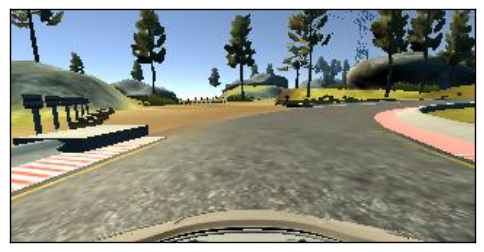

# **Behavioral Cloning** 
---

**Behavioral Cloning Project**

The goals / steps of this project are the following:
* Use Udacity's simulator to collect data of good driving behavior
* Build, a convolution neural network in Keras that predicts steering angles from images
* Train and validate the model with a training and validation set
* Test that the model successfully drives around track one without leaving the road

[//]: # (Image References)

---
### Files Submitted & Code Quality

#### 1. Project Files

My project includes the following files:
* model.py containing the script to create and train the model
* drive.py for driving the car in autonomous mode
* model.h5 containing a trained convolution neural network 

#### 2. Submission includes functional code
Using the Udacity provided simulator and my drive.py file, the car can be driven autonomously around the track by executing 
```sh
python drive.py model.h5
```

#### 3. Submission code is usable and readable

The model.py file contains the code for training and saving the convolution neural network. The file shows the pipeline I used for training and validating the model, and it contains comments to explain how the code works.

### Model Architecture and Training Strategy

#### 1. An appropriate model architecture has been employed

The design of the network is inspired from [NVIDIA's model](https://devblogs.nvidia.com/deep-learning-self-driving-cars/) for end-to-end self driving. The following changes were made
* I used a Keras Crop2D layer to crop the image to retain only the lower part which has the most information for the task.
* I used a Lambda layer to normalize the image pixel values to reduce the problem of exploding gradients.
* I also used a Dropout layer to include Regularization to the model which will prevent overfitting.

Below is the structure of my model

| Layer (type)                   |Output Shape      
|--------------------------------|------------------|
|cropping2d (Cropping2D)         |(None, 75, 320, 3)|
|lambda_1 (Lambda)               |(None, 75, 320, 3)|
|convolution2d_1 (Convolution2D) |(None, 36, 158,24)|
|convolution2d_2 (Convolution2D) |(None, 16, 77, 36)|
|convolution2d_3 (Convolution2D) |(None, 6, 37, 48) |
|convolution2d_4 (Convolution2D) |(None, 4, 35, 64) |
|convolution2d_5 (Convolution2D) |(None, 2, 33, 64) |
|dropout_1 (Dropout)             |(None, 2, 33, 64) |
|flatten_1 (Flatten)             |(None, 4224)      |
|dense_1 (Dense)                 |(None, 100)       |
|dense_2 (Dense)                 |(None, 50)        |
|dense_3 (Dense)                 |(None, 10)        |
|dense_4 (Dense)                 |(None, 1)         |

#### 2. Attempts to reduce overfitting in the model

The model contains dropout layers in order to reduce overfitting. 

The model was trained and validated on different data sets to ensure that the model was not overfitting. The model was tested by running it through the simulator and ensuring that the vehicle could stay on the track.

#### 3. Model parameter tuning

The model used an adam optimizer, so the learning rate was not tuned manually.

#### 4. Appropriate training data

Training data was chosen to keep the vehicle driving on the road. I used a combination of center lane driving, recovering from the left and right sides of the road. Also as the track is left turn biased, I used data augmentation to feed appropriate training data. 

For details about how I created the training data, see the next section. 

### Image Preprocessing and Augmentation

* The image was cropped from the top and bottom to hide the sky and the car front. This was done using Keras' `Cropping2D` layer.
* The image was normalized to fall between -1 to 1 using a `Lambda` layer in Keras.
* The image was also converted from the RGB color space to YUV color space to add a degree of invariance to Light conditions.
* To increase the robustness of the dataset, I randomly selected one image from either the center, left or right images. If left image was used the steering angle (ground truth) was increased by 0.2 and vice-versa for right image.
* As the track was left turn biased, our model would not learn how to turn right. Hence I randomly vertically flipped the image along with the steering values to train the model on right biased tracks, mitigating the bias.

Some of the samples are given below

**Center Image**


**Left Image**


**Right Image**


**Flipped Image**



### Training, Validation and Testing

* I divided the dataset into 2 parts - Training (80%) and Validation (20%). Testing was done directly on the simulator.
* As the dataset was huge and loading all the images into RAM in 1 go didn't make sense, I used Python Generators to load data only as required. To use Generators, I had to use keras' `fit_generator` function.
* I used mean squared error for the loss function to measure how close the model predicts to the given steering angle for each image.
* During testing of the final model, the car succesfully completes the whole track without going off-track even once.

### Improvements

* I would like to see how all the 3 images - Center, Left and Right would work if we feed them together to the model.
* Using a more complex architecture such as a RNN would imporve accuracy as it will retain the temporal data from the dataset.
